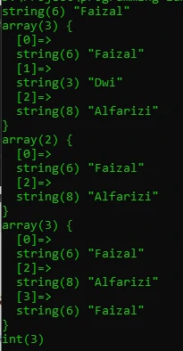

# Tipe Data Array

## Tipe Data Array

- Array adalah tipe data yang berisikan kosong atau banyak data
- Array di PHP bisa berisikan data dengan jenis berbeda-beda
- Array di PHP memiliki panjang dinamis, artinya kita bisa menambah data ke Array sebanyak-banyaknya, tidak dibatasi kapasitasnya

---

## Cara Kerja Array


---

## Kode : Membuat Array

```php
$values = array(1, 2, 3, 4);
var_dump($values);

$names = ["Faizal", "Dwi", "Alfarizi"];
var_dump($names);
```

**Hasil :**


---

## Operasi Array

<table border="1" width="100%">
    <tr>
        <th>Operasi</th>
        <th>Keterangan</th>
    </tr>
    <tr>
        <td>$array[index]</td>
        <td>Mengakses data di array pada nomor index</td>
    </tr>
    <tr>
        <td>$array[index] = value</td>
        <td>Mengubah data di array pada nomor index dengan value baru</td>
    </tr>
    <tr>
        <td>$array[] = value</td>
        <td>Menambah data di array pada posisi paling belakang</td>
    </tr>
    <tr>
        <td>unset($array[index])</td>
        <td>Menghapus data di array, index otomatis hilang dari array</td>
    </tr>
    <tr>
        <td>count($array)</td>
        <td>Mengambil total data di array</td>
    </tr>
</table>

---

## Kode : Operasi Array

```php
$names = ["Faizal", "Dwi", "Alfarizi"];
var_dump($names[0]);
$names[0] = "Faizal";
var_dump($names);
unset($names[1]);
var_dump($names);
$names[] = "Faizal";
var_dump($names);
var_dump(count($names));
```

**Hasil :**



---

## Array Sebagai Map

- Biasanya di kebanyakan bahasa pemrograman, terdapat tipe data bernama Map, yaitu asosiasi antara key dan value
- Namun di PHP, Map bisa dibuat menggunakan Array
- Secara default Array akan menggunakan index (number) sebagai key dan value nya kita bisa bebas memasukkan data ke dalam Array
- Namun jika kita ingin, kita juga bisa mengubah index nya tidak harus menggunakan number, bisa gunakan tipe data lain, seperti string misal nya
- Hal tersebut terlihat seperti Map di bahasa pemrograman lain

---

## Kode : Membuat Map

```php
$faizal = array(
    "id" =>  "faizal",
    "name" => "Faizal Dwi Alfarizi",
    "age" => 20
);

$syiber = [
    "id" => "syiber",
    "name" => "Black Syiber",
    "age" => 23
];
```

---

## Array di dalam Array

- Seperti dijelaskan di awal, Array di PHP bisa berisikan data apapun
- Sehingga kita juga bisa membuat array di dalam array jika memang dibutuhkan

---

## Kode : Array di dalam Array

```php
$faizal = array(
    "id" =>  "faizal",
    "name" => "Faizal Dwi Alfarizi",
    "age" => 20,
    "address" => [
        "city" => "Solo",
        "country" => "Indonesia"
    ]
);
```