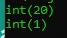

# Operator Aritmatika

## Operator Aritmatika (1)

<table border="1" width="100%">
    <tr>
        <th>Operator</th>
        <th>Keterangan</th>
    </tr>
    <tr>
        <td>+$variable</td>
        <td>Positif</td>
    </tr>
    <tr>
        <td>-$variable</td>
        <td>Negatif</td>
    </tr>
    <tr>
        <td>$variable + $variable</td>
        <td>Penambahan</td>
    </tr>
    <tr>
        <td>$variable - $variable</td>
        <td>Pengurangan</td>
    </tr>
    <tr>
        <td>$variable * $variable</td>
        <td>Perkalian</td>
    </tr>
    <tr>
        <td>$variable / $variable</td>
        <td>Pembagian</td>
    </tr>
</table>

---

## Operator Aritmatika (2)

<table border="1" width="100%">
    <tr>
        <th>Operator</th>
        <th>Keterangan</th>
    </tr>
    <tr>
        <td>$variable % $variable</td>
        <td>Sisa bagi</td>
    </tr>
    <tr>
        <td>$variable ** $variable</td>
        <td>Pangkat</td>
    </tr>
</table>

---

## Kode : Operator Aritmatika

```php
$result = 10 + 10;
var_dump($result);

$result = 100 % 3;
var_dump($result);
```

**Hasil :**

