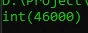

# Operator Penugasan

## Operator Penugasan

- Operator penugasan di PHP sama seperti bahasa pemrograman lain, yaitu dengan menggunakan karakter = (sama dengan)
- Operator penugasan sudah sering kita gunakan, terutama ketika mengubah value sebuah variable
- Namun selain hal itu, operasi penugasan juga bisa digunakan untuk operasi aritmatika

---

## Operator Penugasan Aritmatika

<table border="1" width="100%">
    <tr>
        <th>Penugasan</th>
        <th>Keterangan</th>
    </tr>
    <tr>
        <td>$a += $b</td>
        <td>$a = $a + b</td>
    </tr>
    <tr>
        <td>$a -= $b</td>
        <td>$a = $a - b</td>
    </tr>
    <tr>
        <td>$a *= $b</td>
        <td>$a = $a * b</td>
    </tr>
    <tr>
        <td>$a /= $b</td>
        <td>$a = $a / b</td>
    </tr>
    <tr>
        <td>$a %= $b</td>
        <td>$a = $a % b</td>
    </tr>
</table>

---

## Kode : Operator Penugasan Aritmatika

```php
$total = 0;

$fruit = 10000;
$chicken = 35000;
$orangeJuice = 1000;

$total += $fruit;
$total += $chicken;
$total += $orangeJuice;

var_dump($total);
```

**Hasil :**


