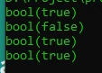

# Operator Perbandingan

## Operator Perbandingan

- Operator perbandingan, seperti namanya, digunakan untuk membandingan dua buat value
- Hasil dari operator perbandingan adalah boolean, true jika perbandingannya benar, false jika perbandingannya salah

---

## Operator Perbandingan (1)

<table border="1" width="100%">
    <tr>
        <th>Operator</th>
        <th>Nama</th>
        <th>Keterangan</th>
    </tr>
    <tr>
        <td>$a == $b</td>
        <td>Sama dengan</td>
        <td>true jika $a sama dengan $b setelah dilakukan konversi tipe data</td>
    </tr>
    <tr>
        <td>$a === $b</td>
        <td>Identik</td>
        <td>true jika $a sama dengan $b dan memiliki tipe data yang sama</td>
    </tr>
    <tr>
        <td>$a != $b</td>
        <td>Tidak sama dengan</td>
        <td>true jika $a tidak sama dengan $b setelah dilakukan konversi tipe data</td>
    </tr>
    <tr>
        <td>$a <> $b</td>
        <td>Tidak sama dengan</td>
        <td>true jika $a tidak sama dengan $b setelah dilakukan konversi tipe data</td>
    </tr>
    <tr>
        <td>$a !== $b</td>
        <td>Tidak identik</td>
        <td>true jika $a tidak sama dengan $b atau tidak sama tipe data</td>
    </tr>
    <tr>
        <td>$a < $b</td>
        <td>Kurang dari</td>
        <td>true jika $a kurang dari $b</td>
    </tr>
    <tr>
        <td>$a <= $b</td>
        <td>Kurang dari atau sama dengan</td>
        <td>true jika $a kurang dari atau sama dengan $b</td>
    </tr>
    <tr>
        <td>$a > $b</td>
        <td>Lebih dari</td>
        <td>true jika $a lebih dari $b</td>
    </tr>
    <tr>
        <td>$a >= $b</td>
        <td>Lebih dari sama dengan</td>
        <td>true jika $a lebih dari atau sama dengan $b</td>
    </tr>
</table>

---

## Kode : Operator Perbandingan

```php
var_dump("10" == 10);
var_dump("10" === 10);

var_dump(10 > 9);
var_dump(10 >= 10);
```

**Hasil :**

