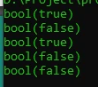

# Operator Logika

## Operator Logika

- Operator logika adalah operator untuk membandingkan dua nilai boolean
- Hasil dari operator logika adalah boolean lagi

---

## Operator Logika

<table border="1" width="100%">
    <tr>
        <th>Operator</th>
        <th>Nama</th>
        <th>Hasil</th>
    </tr>
    <tr>
        <td>$a && $b</td>
        <td>And</td>
        <td>true jika $a dan $b keduanya true</td>
    </tr>
    <tr>
        <td>$a and $b</td>
        <td>And</td>
        <td>true jika $a dan $b keduanya true</td>
    </tr>
    <tr>
        <td>$a || $b</td>
        <td>Or</td>
        <td>true jika $a dan $b salah satu atau keduanya true</td>
    </tr>
    <tr>
        <td>$a or $b</td>
        <td>Or</td>
        <td>true jika $a dan $b salah satu atau keduanya true</td>
    </tr>
    <tr>
        <td>! $a</td>
        <td>Not</td>
        <td>true jika $a bernilai false</td>
    </tr>
    <tr>
        <td>$a xor $b</td>
        <td>Xor</td>
        <td>true jika $a dan $b salah satu true, tapi tidak keduanya</td>
    </tr>
</table>

---

## Kode : Operator Logika

```php
var_dump(true && true);
var_dump(true && false);
var_dump(true || false);
var_dump(true xor true);
var_dump(!true);
```

**Hasil :**

