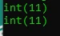

# Increment dan Decrement

## Increment dan Decrement

- PHP mendukung gaya bahasa pemrograman C untuk menaikkan dan menurunkan data number sejumlah 1 angka
- Ini bisa mempersingkat kita ketika ingin menaikkan data

---

## Operator Increment dan Decrement

<table border="1" width="100%">
    <tr>
        <th>Contoh</th>
        <th>Name</th>
        <th>Efek</th>
    </tr>
    <tr>
        <td>$a++</td>
        <td>Post increment</td>
        <td>Kembalikan $a lalu naikkan 1 angka</td>
    </tr>
    <tr>
        <td>++$a</td>
        <td>Pre increment</td>
        <td>Naikkan $a satu angka, lalu kembalikan $a</td>
    </tr>
    <tr>
        <td>$a--</td>
        <td>Post decrement</td>
        <td>Kembalikan $a lalu turunkan 1 angka</td>
    </tr>
    <tr>
        <td>--$a</td>
        <td>Pre decrement</td>
        <td>Turunkan $a satu angka, lalu kembalikan $a</td>
    </tr>
</table>

---

## Kode : Operator Increment dan Decrement

```php
$a = 10;
$b = ++$a;

var_dump($b);
var_dump($a);
```

**Hasil :**

