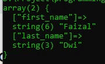

# Operator Array

## Operator Array

- Di PHP, Array memiliki operator khusus
- Mungkin terlihat mirip dengan operator-operator sebelumnya, tapi cara kerjanya sedikit berbeda

---

## Operator Array

<table border="1" width="100%">
    <tr>
        <th>Contoh</th>
        <th>Nama</th>
        <th>Keterangan</th>
    </tr>
    <tr>
        <td>$a + $b</td>
        <td>Union</td>
        <td>Menggabungkan array $a dan $b</td>
    </tr>
    <tr>
        <td>$a == $b</td>
        <td>Equality</td>
        <td>true jika $a dan $b memiliki key-value sama</td>
    </tr>
    <tr>
        <td>$a === $b</td>
        <td>Identity</td>
        <td>true jika $a dan $b memiliki key-value sama dan posisi sama</td>
    </tr>
    <tr>
        <td>$a != $b</td>
        <td>Inequality</td>
        <td>true jika $a dan $b tidak sama</td>
    </tr>
    <tr>
        <td>$a <> $b</td>
        <td>Inequality</td>
        <td>true jika $a dan $b tidak sama</td>
    </tr>
    <tr>
        <td>$a !== $b</td>
        <td>Nonidentity</td>
        <td>true jika $a dan $b tidak identik</td>
    </tr>
</table>

---

## Kode : Operator Array (1)

```php
$first = [
    "first_name" => "Faizal"
];

$last = [
    "last_name" => "Dwi"
];

var_dump($first + $last);
```

**Hasil :**



---

## Kode : Operator Array (2)

```php
$a = [
    "first_name" => "Faizal",
    "last_name" => "Dwi"
];

$b = [
    "last_name" => "Dwi",
    "first_name" => "Faizal"
];

var_dump($a == $b);
var_dump($a === $b);
```

**Hasil :**

