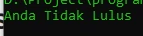

# If Statement

## If Statement

- Dalam PHP, if adalah salah satu kata kunci yang digunakan untuk percabangan
- Percabangan artinya kita bisa mengeksekusi kode program tertentu ketika suatu kondisi terpenuhi
- Hampir di semua bahasa pemrograman mendukung if expression

---

## Syntax If Statement

```php
if(expression)
    statement;

if(expression) {
    statement1;
    statement2;
}
```

---

## Kode : If Statement

```php
$nilai = 70;
$absen = 90;

if($nilai >= 75 && $absen >= 75) {
    echo "Anda Lulus" . PHP_EOL;
}
```

---

## Else Statement

- Blok if akan dieksekusi ketika kondisi if bernilai true
- Kadang kita ingin melakukan eksekusi program tertentu jika kondisi if bernilai false
- Hal ini bisa dilakukan menggunakan else statement

---

## Syntax Else Statement

```php
if(expression)
    statement;
else
    statement;

if(expression) {
    statement1;
    statement2;
} else {
    statement;
}
```

---

## Kode : Else Statement

```php
$nilai = 70;
$absen = 90;

if($nilai >= 75 && $absen >= 75) {
    echo "Anda Lulus" . PHP_EOL;
} else {
    echo "Anda Tidak Lulus" . PHP_EOL;
}
```

**Hasil :**



---

## Else If Statement

- Kada dalam If, kita butuh membuat beberapa kondisi
- Kasus seperti ini, di PHP kita bisa menggunakan Else If statement
- Else if di PHP bisa lebih dari satu
- Kode Else if di php bisa menggunakan “else if” atau “elseif” (digabung)

---

## Syntax Else If Statement

```php
if(expression)
    statement;
elseif
    statement;
else
    statement;

if(expression) {
    statement1;
    statement2;
} elseif {
    statement;
} else {
    statement;
}
```

---

## Kode : Else If Statement

```php
if ($nilai >= 88 && $absen >= 80) {
    echo "Nilai Anda A" . PHP_EOL;
} elseif ($nilai >= 70 && $absen >= 70) {
    echo "Nilai Anda B" . PHP_EOL;
} elseif ($nilai >= 60 && $absen >= 60) {
    echo "Nilai Anda C" . PHP_EOL;
} elseif ($nilai >= 50 && $absen >= 50) {
    echo "Nilai Anda D" . PHP_EOL;
} else {
    echo "Nilai Anda E" . PHP_EOL;
}
```

---

## Syntax Alternatif

- Selain menggunakan {} (kurung kurawal), PHP juga menyediakan syntax alternatif untuk menggunakan if, yaitu dengan menggunakan : (titik dua)
- Namun untuk menggunakan ini, kita harus menggunakan kata kunci endif diakhir if statement

---

## Kode : If Statement Dengan Colon

```php
if ($nilai >= 88 && $absen >= 80) :
    echo "Nilai Anda A" . PHP_EOL;
elseif ($nilai >= 70 && $absen >= 70) :
    echo "Nilai Anda B" . PHP_EOL;
elseif ($nilai >= 60 && $absen >= 60) :
    echo "Nilai Anda C" . PHP_EOL;
elseif ($nilai >= 50 && $absen >= 50) :
    echo "Nilai Anda D" . PHP_EOL;
else :
    echo "Nilai Anda E" . PHP_EOL;
endif;
```