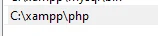
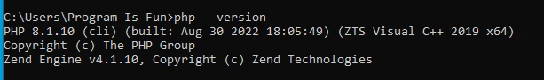

# Menginstall PHP

## Menginstall PHP

- PHP bisa di install di sistem operasi apapun, Windows, Mac ataupun Linux
- Namun menginstall PHP secara manual tidak terlalu mudah
- Oleh karena itu untuk belajar, direkomendasikan menginstall PHP dengan bantuan tool-tool yang sudah mem-bundle PHP dengan teknologi pendukungnya

---

## Menginstall XAMPP

- Pada course ini, kita akan menggunakan aplikasi XAMPP, dimana aplikasi ini telah mem-bundle PHP, MySQL/MariaDB, Apache HTTPD, dan lain-lain
- https://www.apachefriends.org/

---

## Setting PATH

- Setelah menginstall PHP, kita perlu mengatur PATH sistem operasi yang kita gunakan
- Tiap sistem operasi berbeda-beda cara setting PATH nya
- Inti dari setting PATH adalah, agar kita bisa mengakses PHP dari command prompt / terminal

## Untuk Linux atau Mac 

- tambahkan di .bashrc atau .profile atau .zshrc

```bash
export PATH="/Applications/XAMPP/bin:$PATH"
```

---

## Untuk di windows 
- tambahkan di enviroument

- cek di cmd


---

## Text Editor

- VisualStudio Code https://code.visualstudio.com/
- Sublime Text https://www.sublimetext.com/
- Atom https://atom.io/
- PHPStorm https://www.jetbrains.com/phpstorm/