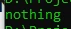

# Null Coalescing Operator

## Null Coalescing Operator

- Sebelumnya kita tahu bahwa data kosong direpresentasikan dengan data NULL di PHP
- Dan hal yang paling repot di PHP adalah mengecek apakah sebuah data ada atau tidak, dan juga apakah data tersebut isinya null atau bukan
- Biasanya untuk melakukan itu, kita perlu menggunakan pengecekan if statement dengan function isset($variable)
- Namun untungnya di php ada null coalescing operator menggunakan tanda ??

---

## Kode : Tanpa Null Coalescing Operator

```php
$data = [];

if(isset($data['action'])) {
    $action = $data['action'];
} else {
    $action = 'nothing';
}

echo $action;
```

**Hasil :**



---

## Kode : Null Coalescing Operator

```php
$data = [];
$action = $data['action'] ?? 'nothing';

echo $action;
```

**Hasil :**

