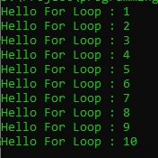

# For Loop

## For Loop
- For adalah salah satu kata kunci yang bisa digunakan untuk melakukan perulangan
- Blok kode yang terdapat di dalam for akan selalu diulangi selama kondisi for terpenuhi

---

## Sintak Perulangan For

```php
for(init statement; kondisi; post statement){
 // block perulangan
}
```

- Init statement akan dieksekusi hanya sekali di awal sebelum perulangan
- Kondisi akan dilakukan pengecekan dalam setiap perulangan, jika true perulangan akan dilakukan, jika false perulangan akan berhenti
- Post statement akan dieksekusi setiap kali diakhir perulangan
- Init statement, Kondisi dan Post Statement tidak wajib diisi, jika Kondisi tidak diisi, berarti kondisi selalu bernilai true

---

## Kode : Perulangan Tanpa Henti

```php
for(; ;) {
    echo "Hello For Loop" . PHP_EOL;
}
```

---

## Kode : Perulangan Dengan Kondisi

```php
$counter = 1;

for(; $counter <= 10;) {
    echo "Hello For Loop : " . $counter . PHP_EOL;
    $counter++;
}
```

**Hasil :**



---

## Kode : Perulangan Dengan Init Statement

```php
for ($counter = 1; $counter <= 10; ) {
    echo "Hello For Loop : " . $counter . PHP_EOL;
    $counter++;
}
```

**Hasil :**


---

## Kode : Perulangan Dengan Post Statement

```php
for ($counter = 1; $counter <= 10; $counter++) {
    echo "Hello For Loop : " . $counter . PHP_EOL;
}
```

**Hasil :**


---

## Kode : Syntax Alternative For Loop

```php
for ($counter = 1; $counter <= 10; $counter++) :
    echo "Hello For Loop : " . $counter . PHP_EOL;
endfor;
```