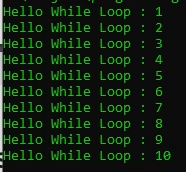

# While Loop

## While Loop

- While loop adalah versi perulangan yang lebih sederhana dibanding for loop
- Di while loop, hanya terdapat kondisi perulangan, tanpa ada init statement dan post statement

---

## Kode : While Loop

```php
$counter = 1;

while ($counter <= 10) {
    echo "Hello While Loop : " . $counter . PHP_EOL;
    $counter++;
}
```

**Hasil :**



---

## Kode : Syntax Alternative While Loop

```php
$counter = 1;

while ($counter <= 10) :
    echo "Hello While Loop : " . $counter . PHP_EOL;
    $counter++;
endwhile;
```