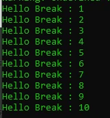
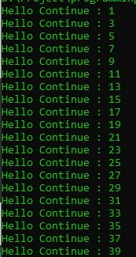

# Break & Continue

## Break & Continue
- Pada switch statement, kita sudah mengenal kata kunci break, yaitu untuk menghentikan case dalam switch
- Sama dengan pada perulangan, break juga digunakan untuk menghentikan seluruh perulangan.
- Namun berbeda dengan continue, continue digunakan untuk menghentikan perulangan saat ini, lalu melanjutkan ke perulangan selanjutnya

---

## Kode : Break

```php
while (true) {
    echo "Hello Break : " . $counter . PHP_EOL;
    $counter++;

    if($counter > 10) {
        break;
    }
}
```

**Hasil :**



---

## Kode : Continue

```php
for($counter = 0; $counter <= 100; $counter++) {
    if($counter % 2 == 0) {
        continue;
    }
    echo "Hello Continue : " . $counter . PHP_EOL;
}
```

**Hasil :**

