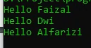
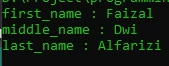

# For Each Loop

# For Each

- Kadang kita biasa mengakses data array menggunakann perulangan
- Mengakses data array menggunakan perulangan sangat bertele-tele, kita harus membuat counter, lalu mengakses array menggunakan counter yang kita buat
- Namun untungnya, di PHP terdapat perulangan for each, yang bisa digunakan untuk mengakses seluruh data di Array secara otomatis

---

## Kode : Tanpa For Each

```php
$names = ["Faizal", "Dwi", "Alfarizi"];

for($i = 0; $i < count($names); $i++ ){
    echo "Hello $names[$i]" . PHP_EOL;
}
```

**Hasil :**



---

## Kode : For Each

```php
$names = ["Faizal", "Dwi", "Alfarizi"];

foreach ($names as $name) {
    echo "Hello $name" . PHP_EOL;
}
```

**Hasil :**


---

## Kode : For Each dengan Key

```php
$person = [
    "first_name" => "Faizal",
    "middle_name" => "Dwi",
    "last_name" => "Alfarizi"
];

foreach ($person as $key => $value)  {
    echo "$key : $value" . PHP_EOL;
}
```

**Hasil :**

