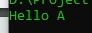
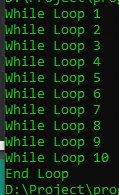

# goto Operator

## goto Operator

- Salah satu fitur yang sebenarnya jarang sekali digunakan di PHP adalah goto operator
- Kenapa jarang digunakan karena jika terlalu banyak menggunakan goto operator, kode program aplikasinya akan mudah membingungkan yang membaca kode nya
- goto adalah fitur dimana kita bisa loncat ke kode program sesuai dengan keinginan kita
- Agar goto bisa loncat ke kode program, kita harus membuat label di php dengan menggunakan nama label lalu diakhiri : (colon)

---

## Kode : goto Operator

```php
goto a;
echo "Hello A" . PHP_EOL;

a:
echo "Hello A" . PHP_EOL;
```

**Hasil :**



---

## Kode : goto Operator di Loop

```php
$counter = 1;
while (true) {
    echo "While Loop $counter" . PHP_EOL;
    $counter++;
    if($counter > 10) {
        goto end;
    }
}

end:
echo "End Loop";
```

**Hasil :**

