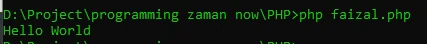

# Program Hello World

## File PHP

- File kode program PHP diakhiri dengan extention .php
- Di awal kode program PHP, wajib menambahkan <?php. Dan diakhir kode program php perlu ditambahkan ?> (tapi tidak wajib)
- Nama file PHP tidak ada aturan, jadi kita bisa membuat file PHP seperti membuat file lain biasanya. Namun agar mempermudah saat menjalankan file PHP, direkomendasikan tidak menggunakan spasi.
- Untuk menampilkan tulisan di PHP, kita bisa menggunakan perintah echo

---

## Program Hello World

```php
<?php

echo "Hello World";
```

**Hasil :**



---

## Menjalankan Kode Program

```batch
php NamaFile.php
```