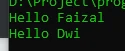
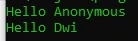
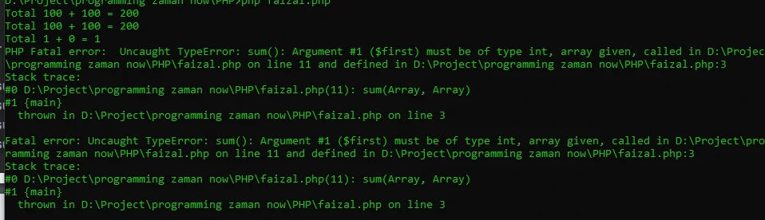
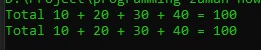

# Function Argument

## Function Argument

- Kita bisa mengirim informasi ke function yang ingin kita panggil
- Untuk melakukan hal tersebut, kita perlu menambahkan argument atau parameter di function yang sudah kita buat
- Cara membuat argument sama seperti cara membuat variabel
- Argument ditempatkan di dalam kurung () di deklarasi function
- Argument bisa lebih dari satu, jika lebih dari satu, harus dipisah menggunakan tanda koma

---

## Kode : Function Argument

```php
function sayHello() {
    echo "Hello $name" . PHP_EOL;
}

sayHello();
sayHello();
```

**Hasil :**



---

## Default Argument Value

- PHP mendukung default argument value
- Fitur ini memungkinkan jika ketika kita memanggil function tidak memasukkan parameter, kita bisa menentukan data default nya apa

---

## Kode : Default Argument Value

```php
function sayHello($name = "Anonymous") {
    echo "Hello $name" . PHP_EOL;
}

sayHello();
sayHello("Dwi");
```

**Hasil :**



---

## Kesalahan Default Argument Value

- Default argument value bisa disimpan argument manapun
- Namun jika argument lebih dari satu, dan kita menyimpan default argument value di parameter awal, maka itu kurang berguna

---

## Kode : Kesalahan Default Argument Value

```php
function sayHello($firstname = "Anonymous", $lastname) {
    echo "Hello $firstname $lastname" . PHP_EOL;
}

sayHello("Faizal");
```

---

## Type Declaration

- Sama seperti variable, argument di PHP bisa kita masukkan data yang dinamis
- Kadang terlalu dinamis juga menyulitkan jika ternyata kita hanya ingin membuat function yang menggunakan argument dengan tipe data tertentu
- Untungnya di PHP, kita bisa menambahkan type data di argument, sehingga PHP akan melakukan pengecekan ketika kita mengirim value ke function tersebut
- Jika tipe data value tidak sesuai, maka akan terjadi error
- Secara default PHP akan melakukan percobaan konversi tipe data secara otomatis, misal jika kita menggunakan tipe int, tapi kita mengirim string, maka PHP akan otomatis mengkonversi string tersebut menjadi int

---

## Valid Types (1)

<table border="1" width="100%">
    <tr>
        <th>Type</th>
        <th>Keterangan</th>
    </tr>
    <tr>
        <td>Class / Interface</td>
        <td>Parameter harus tipe Class / Interface</td>
    </tr>
    <tr>
        <td>self</td>
        <td>Parameter harus sama dengan Class dimana function ini dibuat</td>
    </tr>
    <tr>
        <td>array</td>
        <td>Parameter harus array</td>
    </tr>
    <tr>
        <td>callable</td>
        <td>Parameter harus callable</td>
    </tr>
    <tr>
        <td>bool</td>
        <td>Parameter harus boolean</td>
    </tr>
    <tr>
        <td>float</td>
        <td>Parameter harus floating point</td>
    </tr>
    <tr>
        <td>int</td>
        <td>Parameter harus integer number</td>
    </tr>
    <tr>
        <td>string</td>
        <td>Parameter harus string</td>
    </tr>
    <tr>
        <td>interable</td>
        <td>Parameter harus array atau tipe Traversable</td>
    </tr>
    <tr>
        <td>object</td>
        <td>Parameter harus sebuah object</td>
    </tr>
</table>

---

## Kode : Type Declaration

```php
function sum(int $first, int $last) {
    $total = $first + $last;
    echo "Total $first + $last = $total" . PHP_EOL;
}

sum("100", "100");
sum(100, 100);
sum(true, false);
sum([], []);
```

**Hasil :**



---

## Variable-length Argument List

- Variable-length argument list merupakan kemampuan dimana kita bisa membuat sebuah parameter yang menerima banyak value
- Variable-length argument list secara otomatis akan membuat argument tersebut menjadi array, namun kita tidak perlu manual mengirim array ke functionnya
- Variable-length argument list hanya bisa dilakukan di argument posisi terakhir
- Untuk membuat variable-length argument list, kita bisa menggunakan tanda … (titik tiga kali) sebelum nama argument

---

## Kode : Variable-length Argument List

```php
function sumAll(...$values) {
    $total = 0;
    foreach($values as $value) {
        $total += $value;
    }
    echo "Total " . implode(" + ", $values) . " = $total" . PHP_EOL;
}

sumAll(10, 20, 30, 40);
sumAll(...[10, 20, 30, 40]);
```

**Hasil :**

