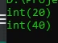
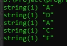
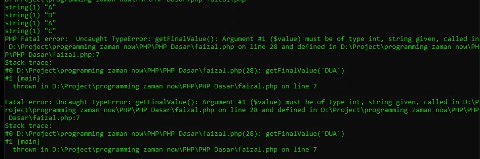

# Function Return Value

## Function Return Value
- Secara default, function itu tidak menghasilkan value apapun, namun jika kita ingin, kita bisa membuat sebuah function mengembalikan nilai
- Dan di dalam block function, untuk menghasilkan nilai tersebut, kita harus menggunakan kata kunci return, lalu diikuti dengan data yang ingin dihasilkan
- Kita hanya bisa menghasilkan 1 data di sebuah function, tidak bisa lebih dari satu

---

## Kode : Function Return Value (1)

```php
function sum(int $first, int $second) {
    return $first + $second;
}

$total = sum(10, 10);
var_dump($total);

$total = sum(20, 20);
var_dump($total);
```

**Hasil :**



---

## Kode : Function Return Value (2)

```php
function getFinalValue(int $value) {
    if($value >= 80) {
        return "A";
    } else if($value >= 70) {
        return "B";
    } else if($value >= 60) {
        return "C";
    } else if($value >= 50) {
        return "D";
    } else {
        return "E";
    }
}

var_dump(getFinalValue(93));
var_dump(getFinalValue(58));
var_dump(getFinalValue(83));
var_dump(getFinalValue(62));
var_dump(getFinalValue(38));
```

**Hasil :**



---

## Return Type Declarations

- Sama seperti pada argument, pada return value pun kita bisa mendeklarasikan tipe datanya
- Hal ini selain mempermudah kita ketika membaca tipe data kembalian function, bisa juga digunakan untuk menjaga jangan sampai kita mengembalikan tipe data yang salah di function
- Untuk mendeklarasikan tipe data kembalian function, setelah kurung () kita bisa tambahkan : diikuti tipe data kembaliannya

---

## Kode : Return Type Declarations

```php
function sum(int $first, int $second) : int {
    return $first + $second;
}

function getFinalValue(int $value) : string {
    if($value >= 80) {
        return "A";
    } else if($value >= 70) {
        return "B";
    } else if($value >= 60) {
        return "C";
    } else if($value >= 50) {
        return "D";
    } else {
        return "E";
    }

    echo "Inputan anda salah"  . PHP_EOL;
}


var_dump(getFinalValue(93));
var_dump(getFinalValue(58));
var_dump(getFinalValue(83));
var_dump(getFinalValue(62));
var_dump(getFinalValue("DUA"));
```

**Hasil :**

