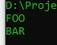
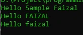

# Variable Function

## Variable Function

- PHP mendukung konsep yang bernama variable function
- Variable function adalah kemampuan memanggil sebuah function dari value yang terdapat di sebuah variable
- Untuk menggunakan variable function, kita bisa secara langsung memanggil $namaVariable(), jika ingin menambahkan argument, kita bisa menggunakan $namaVariable(argument)

---

## Kode : Variable Function

```php
function foo()
{
    echo "FOO" . PHP_EOL;
}

function bar()
{
    echo "BAR" . PHP_EOL;
}

$functionName = "foo";
$functionName();

$functionName = "bar";
$functionName();
```

**Hasil :**



---

## Kode : Penggunaan Variable Function

```php
function sayHello(string $name, $filter) {
    $finalName = $filter($name);
    echo "Hello $finalName" . PHP_EOL;
}

function sampleFunction(string $name) : string {
    return "Sample $name";
}

sayHello("Faizal", "sampleFunction");
sayHello("Faizal", "strtoupper");
sayHello("Faizal", "strtolower");
```

**Hasil :**

