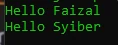
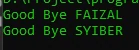
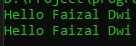

# Anonymous Function

## Anonymous Function

- Anonymous function adalah function tanpa nama, di PHP disebut juga dengan Closure
- Anonymous function biasanya digunakan sebagai argument atau sebagai value di variable
- Anonymous function membuat kita bisa mengirim function sebagai argument di function lainnya

---

## Kode : Anonymous Function

```php
$sayHello = function(string $name) {
    echo "Hello $name" . PHP_EOL;
};

$sayHello("Faizal");
$sayHello("Syiber");
```

**Hasil :**



---

## Kode : Anonymous Function Sebagai Argument

```php
function sayGoodBye(string $name, $filter) {
    $finalName = $filter($name);
    echo "Good Bye $finalName" . PHP_EOL;
}

sayGoodBye("Faizal", function(string $name) : string {
    return strtoupper($name);
});

// sama dengan

$filterFuntion = function(string $name) : string {
    return strtoupper($name);
};

sayGoodBye("Syiber", $filterFuntion);
```

**Hasil :**



---

## Mengakses Variable di Luar Closure

- Secara default, anonymous function tidak bisa mengakses variabel yang terdapat diluar function
- Jika kita ingin menggunakan variable yang terdapat diluar anonymous function, kita perlu secara explicit menyebutkannya menggunakan kata kunci use lalu diikuti variable-variable yang ingin kita gunakan

---

## Kode : Mengakses Variable Luar

```php
$firstName = "Faizal";
$lastName = "Dwi";

$sayHelloFaizal = function() use ($firstName, $lastName) {
    echo "Hello $firstName $lastName" . PHP_EOL;
};

$sayHelloFaizal();

$firstName = "Black";
$lastName = "Syiber";

$sayHelloFaizal();
```

**Hasil :**

