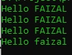

# Callback Function

## Callback Function

- Callback adalah sebuah mekanisme sebuah function memanggil function lainnya sesuai dengan yang diberikan di argument
- Hal ini sebenarnya sudah kita lakukan di materi Variable Function dan Anonymous Function
- Namun di PHP ada cara lain untuk implementasi callback, yaitu menggunakan tipe data callable
- Dan untuk memanggil callback function tersebut, kita bisa menggunakan function **`call_user_func(callable, arguments)`**

---

## Kode : Callback Function

```php
function sayHello(string $name, callable $filter) {
    $finalName = call_user_func($filter, $name);
    echo "Hello $finalName" . PHP_EOL;
}

sayHello("Faizal", function($name) { 
    return strtoupper($name); 
});
sayHello("Faizal", fn($name) => strtoupper($name));
sayHello("Faizal", "strtoupper");
sayHello("Faizal", "strtolower");
```

**Hasil :**

