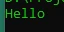

# Komentar

## Komentar

- Kadang dalam membuat program, kita sering menempatkan komentar di kode program tersebut
- Komentar adalah kode program yang akan di hiraukan saat kode program kita dijalankan
- Biasanya komentar digunakan untuk dokumentasi

---

## Kode : Komentar

```php
/*
Komentar multi baris, bisa untuk
lebih dari satu baris
*/
function sayHello() {
    // ini komentar satu baris
    echo "Hello" . PHP_EOL;
}

sayHello();
```

**Hasil :**

