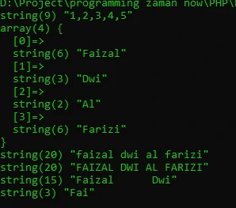

# String Function

## String Function

- Sebelumnya saya pernah menggunakan beberapa function bawaan dari PHP untuk memanipulasi data string.
- Sebenarnya banyak sekali function bawaan PHP yang bisa kita gunakan untuk memanipulasi string
- https://www.php.net/manual/en/ref.strings.php

---

## Contoh String Function

<table border="1" width="100%">
    <tr>
        <th>Function</th>
        <th>Keterangan</th>
    </tr>
    <tr>
        <td>join() / implode()</td>
        <td>Menggabungkan array menjadi string</td>
    </tr>
    <tr>
        <td>explode()</td>
        <td>Memecah string menjadi array</td>
    </tr>
    <tr>
        <td>strtolower()</td>
        <td>Mengubah string menjadi lowercase</td>
    </tr>
    <tr>
        <td>strtoupper()</td>
        <td>Mengubah string menjadi uppercase</td>
    </tr>
    <tr>
        <td>substr()</td>
        <td>Mengambil sebagian string</td>
    </tr>
    <tr>
        <td>trim()</td>
        <td>Menghapus whitespace di depan dan belakang string</td>
    </tr>
</table>

---

## Kode : String Function

```php
var_dump(join(",", [1, 2, 3, 4, 5]));
var_dump(explode(" ", "Faizal Dwi Al Farizi"));
var_dump(strtolower("FAIZAL DWI AL FARIZI"));
var_dump(strtoupper("Faizal Dwi Al Farizi"));
var_dump(trim("        Faizal      Dwi       "));
var_dump(substr("Faizal Dwi Al Farizi", 0, 3));
```

**Hasil :**

