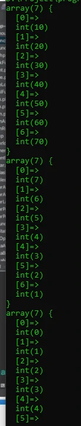

# Array Function

## Array Function

- Di PHP juga terdapat banyak sekali function bawaan yang bisa kita gunakan untuk memanipulasi data Array
- https://www.php.net/manual/en/ref.array.php

---

## Contoh Array Function

<table border="1" width="100%">
    <tr>
        <th>Function</th>
        <th>Keterangan</th>
    </tr>
    <tr>
        <td>array_keys()</td>
        <td>Mengambil semua keys milik array</td>
    </tr>
    <tr>
        <td>array_values()</td>
        <td>Mengambil semua values milik array</td>
    </tr>
    <tr>
        <td>array_map()</td>
        <td>Mengubah semua data array dengan callback</td>
    </tr>
    <tr>
        <td>sort()</td>
        <td>Mengurutkan array</td>
    </tr>
    <tr>
        <td>rsort()</td>
        <td>Mengurutkan array terbalik</td>
    </tr>
    <tr>
        <td>shuffle()</td>
        <td>Mengubah posisi data di array secara random</td>
    </tr>
</table>
---

## Kode : Array Function

```php
$data = [1, 2, 3, 4, 5, 6, 7];

// $mapFunction = fn(int $value) => $value * 10;
// $dataResult = array_map($mapFunction, $data);
// var_dump($dataResult);
var_dump(array_map(fn($data) => $data * 10, $data));

rsort($data);
var_dump($data);

var_dump(array_keys($data));
var_dump(array_values($data));

$person = [
    "first_name" => "Faizal",
    "last_name" => "Alfarizi"
];

var_dump(array_keys($person));
var_dump(array_values($person));
```

**Hasil :**


