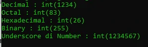
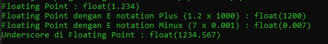
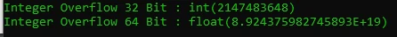

# Tipe Data Number

## Tipe Data Number

- Di PHP terdapat 2 jenis tipe data number
  - (int) Bilangan bulat decimal (base 10), hexadecimal (base 16), octa (base 8), binary (base 2) dan
  - (float) Bilangan pecahan
- Di PHP kita bisa menambahkan _ (garis bawah) di angka, ini hanya untuk agar mudah dibaca, saat dijalankan, _ (garis bawah) tersebut akan di ignore
- Untuk angka negatif, kita bisa menggunakan tanda - (minus) di depan angka

---

## Kode : Tipe Data Integer

```php
echo "Decimal : ";
var_dump(1234);
echo "Octal : ";
var_dump(0123);
echo "Hexadecimal : ";
var_dump(0x1A);
echo "Binary : ";
var_dump(0b11111111);
echo "Underscore di Number : ";
var_dump(1_234_567);
```

**Hasil :**



---

## Kode : Tipe Data Floating Point

```php
echo "Floating Point : ";
var_dump(1.234);
echo "Floating Point dengan E notation Plus (1.2 x 1000) : ";
var_dump(1.2e3);
echo "Floating Point dengan E notation Minux (7 x 0.001) : ";
var_dump(7e-3);
echo "Underscore di Floating Point : ";
var_dump(1_234.567);
```

**Hasil :**



---

## Integer Overflow

- Secara default, kapasitas integer di PHP ada batasnya, 2147483647 untuk sistem operasi 32 bit, dan 9223372036854775807 untuk sistem operasi 64 bit
- Jika kita membuat number integer yang melebihi nilai tersebut, maka secara otomatis tipe numbernya akan berubah menjadi floating point

---

## Kode : Integer Overflow

```php
echo "Integer Overflow 32 Bit : ";
var_dump(2147483648);
echo "Integer Overflow 64 Bit : ";
var_dump(89243759827458927572);
```

**Hasil :**

