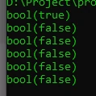

# is Function

## is Function

- PHP memiliki banyak sekali function dengan prefix is_
- Function-function ini rata-rata digunakan untuk mengecek tipe data dari sebuah data
- https://www.php.net/manual/en/ref.var.php

---

## Contoh Is Function

<table border="1" width="100%">
    <tr>
        <th>Function</th>
        <th>Keterangan</th>
    </tr>
    <tr>
        <td>is_string()</td>
        <td>Apakah tipe data string</td>
    </tr>
    <tr>
        <td>is_bool()</td>
        <td>Apakah tipe data boolean</td>
    </tr>
    <tr>
        <td>is_int()</td>
        <td>Apakah tipe data number integer</td>
    </tr>
    <tr>
        <td>is_float()</td>
        <td>Apakah tipe data number floating point</td>
    </tr>
    <tr>
        <td>is_array()</td>
        <td>Apakah tipe data array</td>
    </tr>
    <tr>
        <td>is_callable()</td>
        <td>Apakah tipe data callable</td>
    </tr>
</table>

---

## Kode : Is Function

```php
$data = "Faizal";

var_dump(is_string($data));
var_dump(is_bool($data));
var_dump(is_int($data));
var_dump(is_float($data));
var_dump(is_array($data));
var_dump(is_null($data));
```

**Hasil :**

