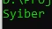
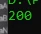

# Reference

## Apa itu Reference?
- Reference adalah mengakses variable yang sama dengan nama variable yang berbeda
- Reference di PHP tidak sama dengan reference di bahasa pemrograman seperti C / C++ yang memiliki fitur pointer
- Analogi Reference itu seperti file, jika variable adalah file, dan value nya adalah isi file nya, maka reference adalah membuat shortcut (di Windows) atau alias (di Linux / Mac) terhadap file yang sama
- Saat kita mengubah isi value dari reference, maka secara otomatis value variable aslinya pun berubah
- Untuk membuat reference terhadap variable, kita bisa menggunakan karakter & Assign By Reference
- Pertama, PHP Reference bisa memungkinkan kita bisa membuat beberapa variable menuju ke value yang sama

---

## Kode : Assign By Reference

```php
<?php

$name = "Faizal";

$otherName = &$name;

$otherName = "Syiber";

echo $name . PHP_EOL;
```

**Hasil :**



---

## Pass By Reference

- Selanjutnya yang bisa dilakukan di PHP adalah, mengirim data ke function dengan reference

---

## Kode : Pass By Reference

### Tanpa Reference

```php
<?php

function increment(int $value) {
    $value++;
}

$counter = 1;
increment($counter);

echo $counter;
```

**Hasil :**


### Menggunakan Reference

```php
<?php

function increment(int &$value) {
    $value++;
}

$counter = 1;
increment($counter);

echo $counter;
```

**Hasil :**


---

## Returning References

- PHP juga bisa mengembalikan reference pada function
- Namun hati-hati, gunakan fitur ini jika memang ada alasannya, karena fitur ini bisa membingungkan

---

## Kode : Returning References

```php
<?php

function &getValue() {
    static $value = 100;
    return $value;
}

$a = &getValue();
$a = 200;

$b = &getValue();
echo $b . PHP_EOL;
```

**Hasil :**

