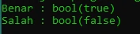

# Tipe Data Boolean

## Tipe Data Boolean

- Tipe data boolean adalah tipe data paling sederhana di PHP
- Tipe data boolean adalah tipe data dengan nilai kebenaran (benar atau salah)
- Nilai benar direpresentasikan dengan true (case insensitive)
- Nilai salah direpresentasikan dengan false (case insensitive)

---

## Kode : Tipe Data Boolean

```php
echo "Benar : ";
var_dump(true);

echo "Salah : ";
var_dump(false);
```

**Hasil :**

