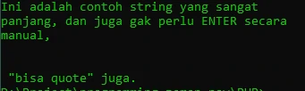
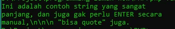

# Tipe Data String

## Tipe Data String
- Tipe data string adalah tipe data representasi dari teks
- String bisa mengandung kosong atau banyak karakter

---

## Single Quote

- Untuk membuat String di PHP, kita bisa menggunakan single quote

```php
echo 'Nama : ';
echo 'Faizal Dwi Al Farizi';
```

**Hasil :**


---

## Double Quote

- Selain single quote, kita juga bisa menggunakan double quote. Salah satu kelebihan menggunakan double
- quote adalah, kita menggunakan escape sequence untuk beberapa hal, seperti \n untuk ENTER \t untuk TAB, \” untuk double quote, dan lain-lain

```php
echo 'Nama : ';
echo 'Faizal Dwi Al Farizi';
echo "\n";

echo "Nama : ";
echo "Faizal\t Dwi\t Alfarizi";
```

**Hasil :**


---

## Multiline String

- Kadang kita ingin membuat data string yang lebih dari satu baris. Untuk melakukan itu sebenarnya kita bisa menggunakan \n sebagai ENTER
- Namun PHP memiliki fitur yang lebih baik, yaitu bernama Heredoc dan Nowdoc

---

## Heredoc

- Heredoc adalah fitur untuk membuat String yang panjang, sehingga kita tidak perlu manual melakukan enter, tab dan yang lain-lain secara manual

```php
echo <<<Faizal
Ini adalah contoh string yang sangat
panjang, dan juga gak perlu ENTER secara
manual,\n\n\n "bisa quote" juga.
Faizal;
```

**Hasil :**



---

## Nowdoc

- Nowdoc mirip seperti Heredoc, yang membedakan adalah pada Nowdoc tidak memiliki kemampuan parsing seperti di Heredoc atau Double Quote. Masalah parsing akan kita bahas di materi Manipulasi String

```php
echo <<<'Faizal'
Ini adalah contoh string yang sangat
panjang, dan juga gak perlu ENTER secara
manual,\n\n\n "bisa quote" juga.
Faizal;
```

**Hasil :**

