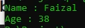
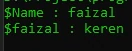

# Variable

---

## Variable

- Variable adalah tempat untuk menyimpan data sehingga bisa kita gunakan lagi di kode program selanjutnya
- Di PHP variable bisa menampung berbagai jenis tipe data dan bisa berubah-ubah tipe data
- Untuk membuat variable kita bisa menggunakan tanda $ (dolar) diikuti dengan nama variable nya
- Penamaan variable tidak boleh mengandung spasi

---

## Kode : Variable

```php
$name = "Faizal";
$age = 38;

echo "Name : ";
echo $name;
echo "\n";
echo "Age : ";
echo $age;
```

**Hasil :**



---

## Variable Variables

- PHP memiliki kemampuan variable variables, yaitu membuat variable dari string value variable
- Walaupun fitur ini ada, tapi fitur ini sangat membingungkan jika digunakan secara luas, jadi disarankan untuk tidak menggunakan fitur ini kecuali memang diperlukan
- Untuk membuat variable dari value variable kita bisa menggunakan $$ diikuti dengan nama variable nya

---

## Kode : Variable Variables

```php
$name = "faizal";
$$name = "keren";

echo "\$Name : ";
echo $name;
echo "\n";
echo "\$faizal : ";
echo $faizal;
echo "\n";
```

**Hasil :**

