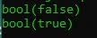

# Data NULL

## Data NULL

- Nilai NULL merepresentasikan sebuah variable tanpa nilai.
- Saat kita membuat variable, lalu ingin menghapus data yang terdapat di variable tersebut, kita bisa menggunakan NULL untuk mengosongkan variable tersebut
- Untuk membuat data NULL, kita bisa menggunakan kata kunci NULL (case insensitive)

---

## Kode : Data NULL

```php
$name = "Faizal";
$name = NULL;

$age = null;
```

---

## Mengecek Apakah Data NULL

- Kadang kita ingin tahu apakah sebuah data bernilai null atau tidak
- Untuk mengecek apakah sebuah data bernilai null, kita bisa menggunakan function is_null($variable)

---

## Kode : Mengecek NULL

```php
$name = "Faizal";
$name = NULL;

$isNull = is_null($name);
var_dump($isNull);
```

**Hasil :**


---

## Menghapus Variable

- Selain mengubah menjadi NULL, di PHP juga kita bisa menghapus sebuah variable, caranya dengan menggunakan function unset($variable)
- Namun hati-hati, ketika kita hapus variable, kita tidak bisa lagi mengakses variable tersebut, bahkan function is_null($variable) pun akan menjadi error jika mengakses variable tersebut.
- Agar lebih aman, kita bisa menggunakan function isset($variable) untuk mengeccek apakah sebuah variable ada dan nilainya tidak NULL

---

## Kode : Unset dan Isset

```php
$value = "Faizal";
unset($value);

var_dump(isset($value));

$value = "Faizal";

var_dump(isset($value));
```

**Hasil :**

